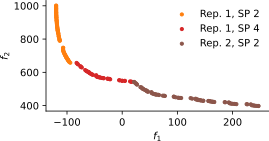

# Architecture Optimization Experiments

Code for experimenting with algorithms for system architecture optimization. System architectures describe how system
components are allocated to perform functions; choosing what does what are important decisions taken early in the design
process with large impact on system performance.

Enabling the optimization of system architectures might improve decision-making in the early design stage. However,
system architecture optimization problems are hard to solve, because they are:

* *black-box*: the optimizer does not know anything about the behavior of the analysis function, and in general the
  design space is non-linear
  (e.g. evaluation is done using some kind of numerical simulation with a non-linear response);
* *mixed-discrete*: some design variables are discrete (i.e. categorical or integer type), others are continuous
  (e.g. choose the number of aircraft engines, and for each engine the bypass ratio);
* *hierarchical*: some design variables might be inactive based on other design variable values
  (e.g. choose whether there will be a wing strut, if yes also choose the spanwise location);
* *multi-objective*: due to conflicting stakeholder demands, the system might be designed for conflicting design goals
  (e.g. optimize both for fuel efficiency and low weight);
* subject to *hidden constraints*: sometimes an evaluation might not return a meaningful result
  (e.g. a simulation might not converge to a solution).

This repository aims to create a reproducible set of experiments to help explain the salient features of architecture
optimization, and investigate effectiveness and efficiency of optimization algorithms. Effectiveness represents how
well an algorithm is able to find a Pareto front (e.g. how close it is to some pre-known Pareto front, and how well
spread it is along this front). Efficiency represents the trade-off between effectiveness and number of function
evaluations (i.e. system simulations) needed to get to a certain result quality.

Optimization is done using the [pymoo](https://pymoo.org/) (multi-objective optimization in python) framework. This
framework includes many multi-objective evolutionary algorithms. Surrogate-based optimization algorithms are implemented
using [scikit-learn](https://scikit-learn.org/) and [SMT](https://smt.readthedocs.io/).

## Installing

```
conda create --name opt python=3.7
conda activate opt
conda install numpy
conda install -c conda-forge smt==0.7.1
pip install -r requirements.txt
```

## Package Structure

- `algorithms` base package where all algorithms not already contained in pymoo are implemented
   - `surrogate` implementation of surrogate-based optimization algorithms, containing the algorithm itself
     (in `surrogate_infill`) and various infill criteria
   - `infill_based.py` base class for an algorithm based on design point infills
- `experiments` folder containing the experiments ran (most interesting ones are probably in `effectiveness`)
- `metrics` package containing performance and convergence metrics
   - `convergence` metrics for detecting algorithm convergence (without knowing the Pareto-front a-priori)
   - `filters` classes for smoothing convergence metrics
   - `performance` metrics for tracking algorithm performance (some need a prior-known Pareto-front)
   - `termination` wrappers of convergence metrics into termination criteria
- `problems` package containing test optimization problems
   - `discrete.py` various mixed-discrete test problems
   - `discretization.py` base classes and utilities for mixed-discrete test problems
   - `hierarchical.py` various mixed-discrete hierarchical test problems
   - `pareto_front.py` mixin for automatically calculating the Pareto front of a test problem
   - `so_mo.py` various multi-objective versions of single-objective test problems
   - `turbofan.py` the realistic engine architecting benchmark problem
- `surrogates` package containing surrogate models
   - `sklearn_models` surrogates and mixed-discrete / hierarchical kernels based on scikit-learn Gaussian processes
   - `smt_models` RBF and Kriging surrogates based on SMT
   - `model.py` base class for surrogate models
- `experimenter.py` implementation of the `Experimenter` class and related utilities

## Analytical Test Problems

There are two main architecture benchmark problems. Both are based on the Goldstein problem, and include mixed-discrete
and hierarchical design variables, and have two objectives.

### Test Problem


Properties:
- 2 objectives
- 27 design variables
  - 16 continuous
  - 6 integer
  - 5 categorical
- ~42% of design variables are active in an initial DOE

```python
from arch_opt_exp.problems.hierarchical import MOHierarchicalTestProblem

problem = MOHierarchicalTestProblem()

# Determine the amount of active design points (due to design variable hierarchy)
problem.print_sparseness()

# Run an optimization using NSGA2 to visualize the Pareto front
problem.run_test()
```

### Test Problem with Hidden Constraints



Properties:
- Same as above
- ~60% of evaluations are invalid in an initial DOE

```python
from arch_opt_exp.problems.hierarchical import HCMOHierarchicalTestProblem

problem = HCMOHierarchicalTestProblem()

# Determine the amount of active design points (due to design variable hierarchy)
problem.print_sparseness()

# Determine the amount of failed evaluations: frac_nan is the fraction of evaluations returning NaN
from arch_opt_exp.metrics.performance import MaxConstraintViolationMetric
MaxConstraintViolationMetric.calc_doe(problem)

# Run an optimization using NSGA2
problem.run_test()
```

## Experimenter

The `Experimenter` class handles running of experiments against a combination of a problem and an algorithm. It can run
two types of experiments:
1. *Effectiveness*, for determining how effective an algorithm is at solving the problem, by running the algorithm with
   a fixed function evaluation budget.
2. *Efficiency*, for investigating the trade-off between effectiveness and evaluation cost, by determining when an
   effectiveness run would have terminated with a given termination metric.

```python
from arch_opt_exp.metrics_base import *
from arch_opt_exp.experimenter import *

from pymoo.factory import get_problem
from pymoo.algorithms.nsga2 import NSGA2
from pymoo.performance_indicator.igd import IGD

# Instantiate the problem, algorithm and experimenter
problem = get_problem('zdt1')
algorithm = NSGA2(pop_size=100)  # Don't worry about the termination at this point

igd_metric = IndicatorMetric(IGD(problem.pareto_front()))

experimenter = Experimenter(
    problem, algorithm,
    n_eval_max=20000,
    metrics=[igd_metric],
    results_folder='results',
)

# Run the effectiveness experiment multiple times to correct for random effects
n = 10
effectiveness_results = experimenter.run_effectiveness_parallel(n_repeat=n)
assert len(effectiveness_results) == n

# Alternative (offline) loading of results
effectiveness_result = experimenter.get_effectiveness_result(repeat_idx=0)
metric_values = effectiveness_result.metrics[igd_metric.name].results()['indicator']

# Run the efficiency experiment with a given termination metric
metric_termination = MetricTermination(igd_metric, lower_limit=.5)  # Define convergence limit

efficiency_results = experimenter.run_efficiency_repeated(metric_termination)
assert len(effectiveness_result) == n

efficiency_result = experimenter.get_efficiency_result(metric_termination, repeat_idx=0)
assert efficiency_result.metric_converged
assert len(efficiency_result.history) < len(effectiveness_result.history)
assert len(efficiency_result.termination.metric.results()['indicator']) == len(efficiency_result.history)
```
